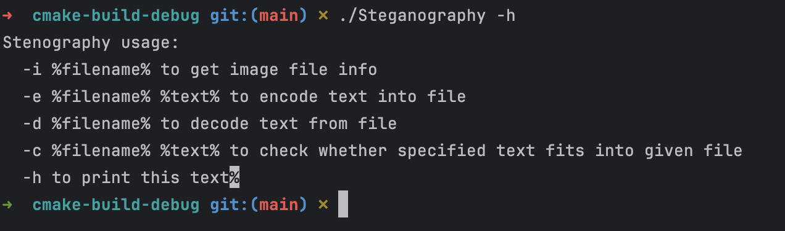

# Steganography Tool 🔒
## Overview
This project is a **steganography tool** implemented in **C++**, designed to **hide messages** within image files while providing **multiple levels of encryption**.  
It supports **PNG, BMP, and PPM** formats, allowing users to embed data by modifying the **least significant bits (LSB)** of pixel values.

The tool offers different encryption levels, giving users control over **how much data** can be stored and **how detectable** the modifications are.

---
## **Features** 🚀
This **C++-based steganography tool** provides a powerful and flexible way to **hide and extract secret messages** from images while supporting multiple encryption levels.  
The project is structured into various modules, including **command handlers, encryption algorithms, exception handling, and image processing**.

### **🔹 Multiple Encryption Levels**
- **1-bit encryption:**
    - Modifies the **least significant bit (LSB) of the blue channel**.
    - **Low visibility**, making detection difficult.

- **2-bit encryption:**
    - Uses **1 bit from the blue channel and 1 bit from another channel** (red or green).
    - Balances **data capacity and image integrity**.

- **4-bit encryption:**
    - Modifies **4 least significant bits across different color channels**.
    - Maximizes **message size** but slightly **alters the image appearance**.

### **🔹 Image Processing Capabilities**
- Efficient **pixel manipulation** with `PixelColor.h` for direct access to image data.
- Dedicated handlers for different formats:
    - `BmpImageStuff.h` (BMP)
    - `PngImageStuff.h` (PNG)
    - `PpmImageStuff.h` (PPM)
- **Preserves original image quality** as much as possible.

### **🔹 Modular and Extensible Architecture**
- `BaseEncryptor.h` provides an **abstraction layer** for different encryption methods.
- `OneBitEncryptor.h`, `TwoBitEncryptor.h`, and `FourBitEncryptor.h` allow **flexible encryption strategies**.
- **Easily extendable** for new encryption techniques.

### **🔹 Command Handlers for User Interaction**
- `EncryptCommandHandler.h` - Processes **encryption requests**.
- `DecryptCommandHandler.h` - Extracts **hidden messages** from stego-images.
- `CheckFileSizeCommandHandler.h` - Ensures **enough space** is available in the image.
- `FileInfoCommandHandler.h` - Provides **metadata and file details**.
- `HelpCommandHandler.h` - Displays **available commands**.

### **🔹 Exception Handling for Robustness**
- `argument_count_exception.h` ensures **correct argument validation**.
- **Built-in error detection** to prevent incorrect operations.

### **🔹 CLI-Based Interface**
- Users can **encrypt and decrypt messages** directly from the **command line**.
- **Simple syntax** for encoding and decoding operations.

---
---
## **Example of Usage**
1. **Build the project**.
2. Ensure that `cmake-build-debug` exists.
3. **Navigate to the build directory** (`cd cmake-build-debug`).
4. Run `./Steganography -h` to **see the available commands**.

---
## **Programming Language**
- **C++** (Functionality and logic)
## **Development Environment**
- **IntelliJ CLion**
---

---
## **Project Structure**

- `2324_16_s31722_ZJM/commandHandlers` - General commandHandlers for program
- `2324_16_s31722_ZJM/encryptors/` - Providing main logic of encrypting your images
- `2324_16_s31722_ZJM/exceptions/` - Providing instructions about exceptions
- `2324_16_s31722_ZJM/Image/` - general format stuff(headers)
- `2324_16_s31722_ZJM/ImagesToTesting` - Directory containing all images to test
- `README.md` - Project documentation
- `LICENSE` - Project license
---
## License
This project is licensed under the MIT License

